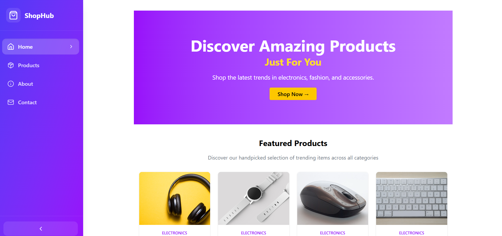

Project Overview

A simple static e-commerce website built with React and Tailwind CSS. It includes multiple pages, reusable components, and basic event handling.

Home Page: Hero banner, featured products, and “Shop Now” button.

Products Page: Product categories with images, prices, and “Add to Cart” button.

About Page: Company description and “Why Choose Us” section.

Contact Page: Contact details and feedback form.

Components

Navbar

Footer

ProductCard (uses props)

HeroSection

Features

Responsive design

Routing between pages (React Router DOM)

Event handling (e.g., Add to Cart, Contact form)

Dynamic data passed via props

Technologies Used

React • Tailwind CSS • React Router DOM • Vite • Git/GitHub

